# Saji.id - Smart POS System 🚀

**Saji.id** adalah aplikasi Kasir (Point of Sale) berbasis Android yang dirancang untuk membantu pengelolaan bisnis UMKM, Cafe, dan Restoran secara modern, efisien, dan terintegrasi dengan teknologi Cloud.

## ✨ Fitur Utama
- **Dashboard Modern:** Tampilan Dashboard profesional dengan estimasi pendapatan real-time (Support Portrait & Landscape).
- **Manajemen Inventaris:** Kelola menu, kategori produk, dan stok barang dengan mudah.
- **Transaksi Cepat:** Proses penjualan yang intuitif dengan fitur diskon dan manajemen pesanan.
- **Multi-Cabang:** Mendukung pengelolaan data untuk banyak cabang toko.
- **Cetak Struk Bluetooth:** Integrasi langsung dengan printer termal Bluetooth untuk mencetak nota belanja secara instan.
- **Manajemen Pegawai:** Pendataan kasir/pegawai lengkap dengan foto profil.
- **Sinkronisasi Cloud:** Menggunakan Firebase Realtime Database untuk data yang selalu sinkron dan Firebase Storage untuk penyimpanan foto produk.
- **Mode Gelap/Terang:** Dukungan tema Day/Night yang menyesuaikan dengan kenyamanan mata pengguna.

## 📱 Screenshots

  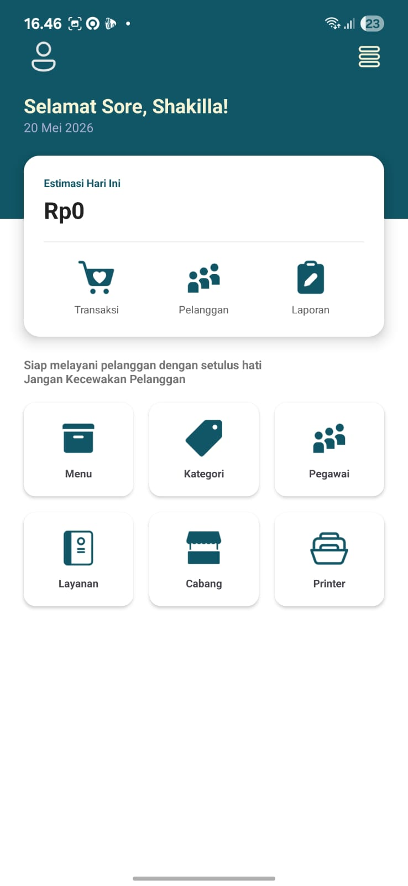
  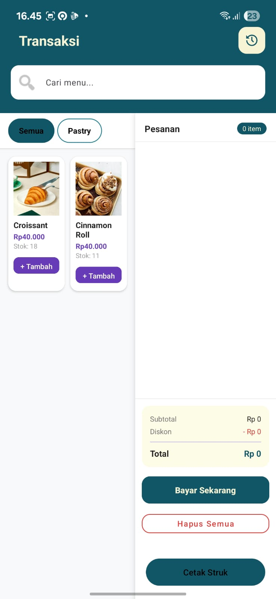
  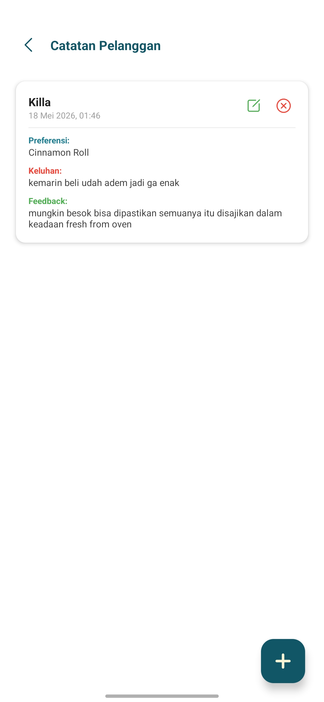
  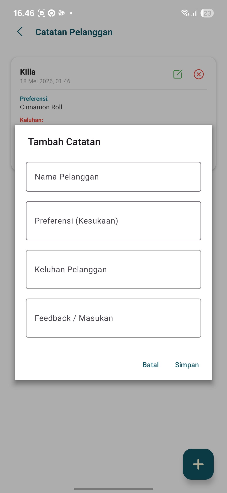
  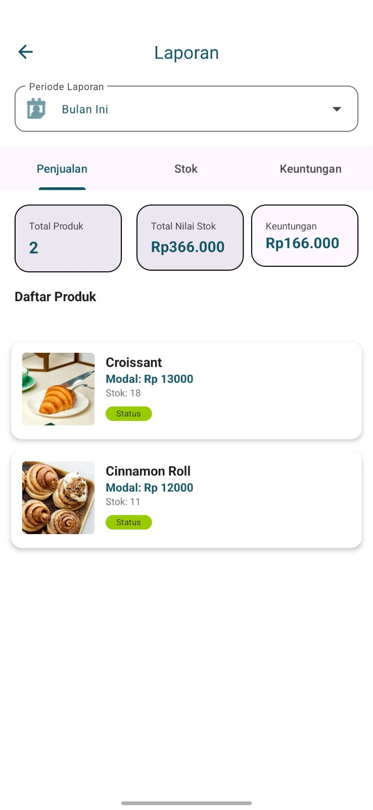
  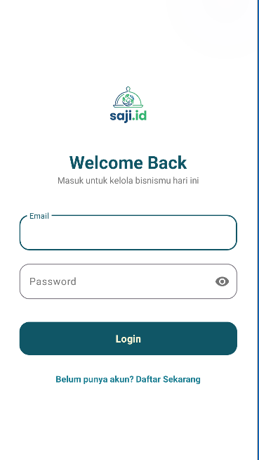
  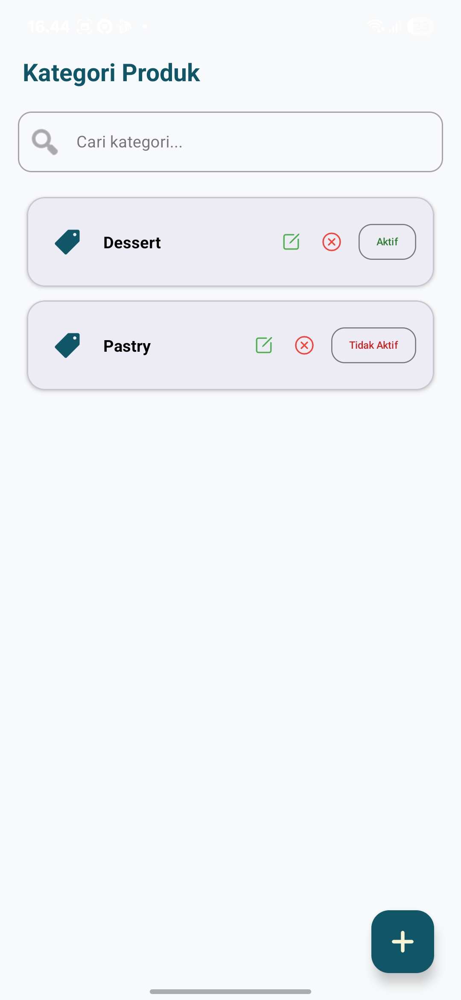
  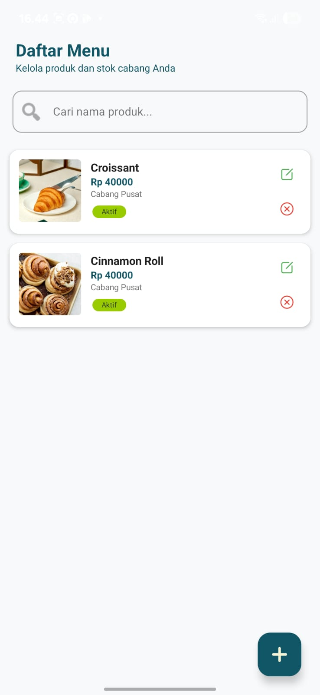
  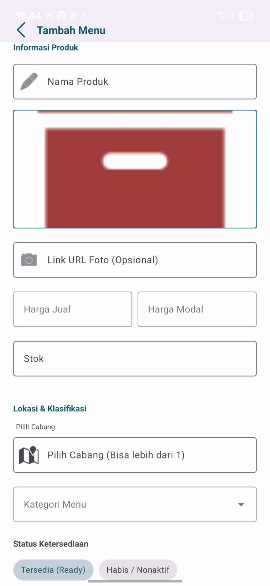
  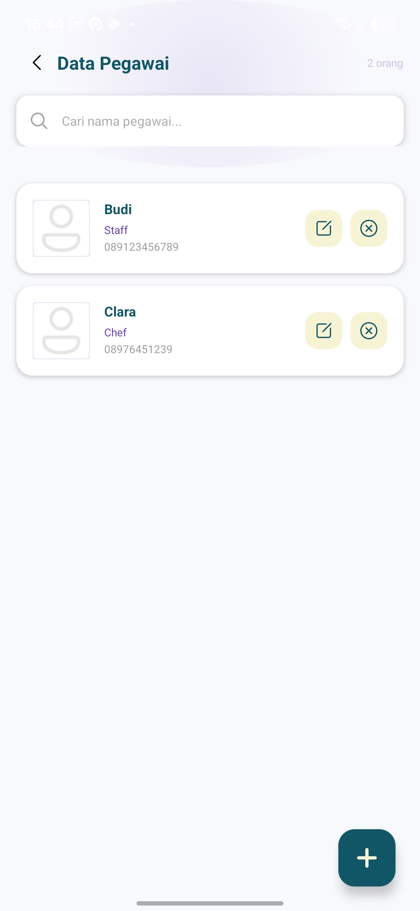
  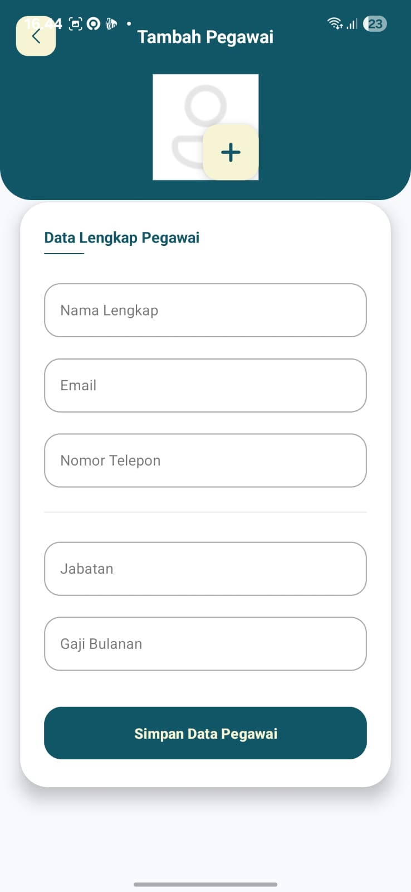
  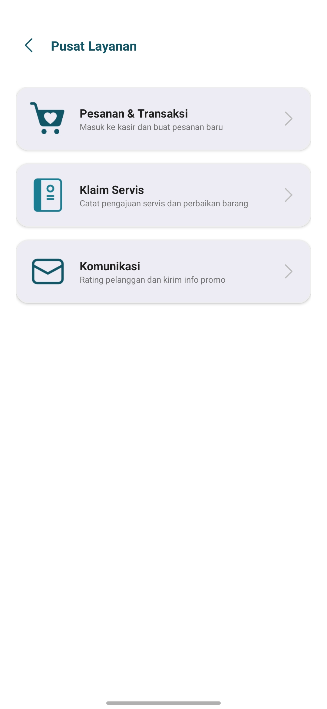
  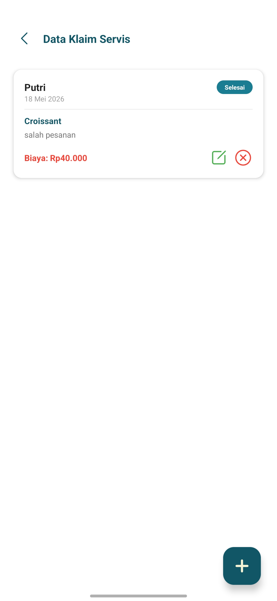
  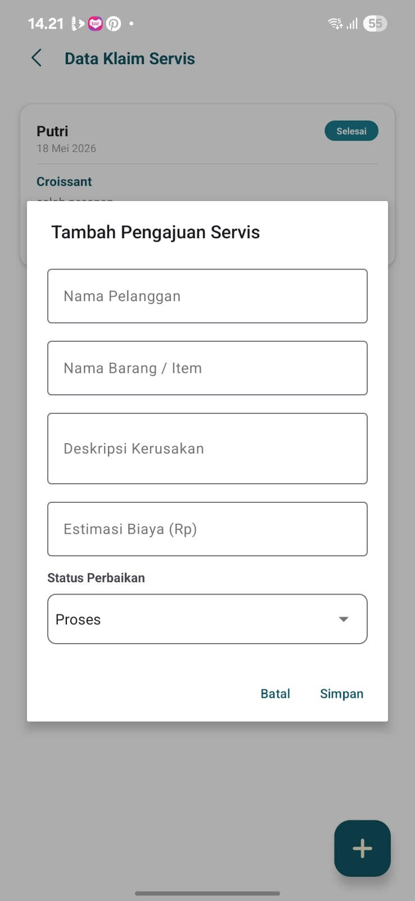
  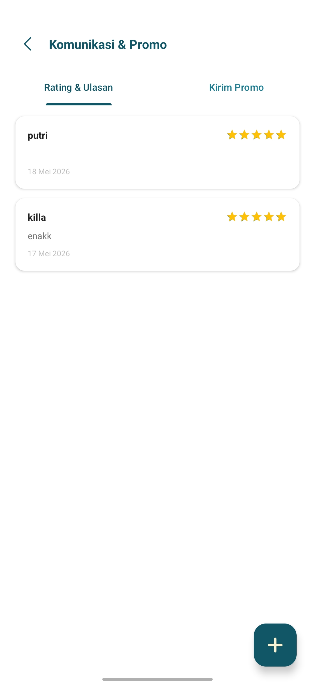
  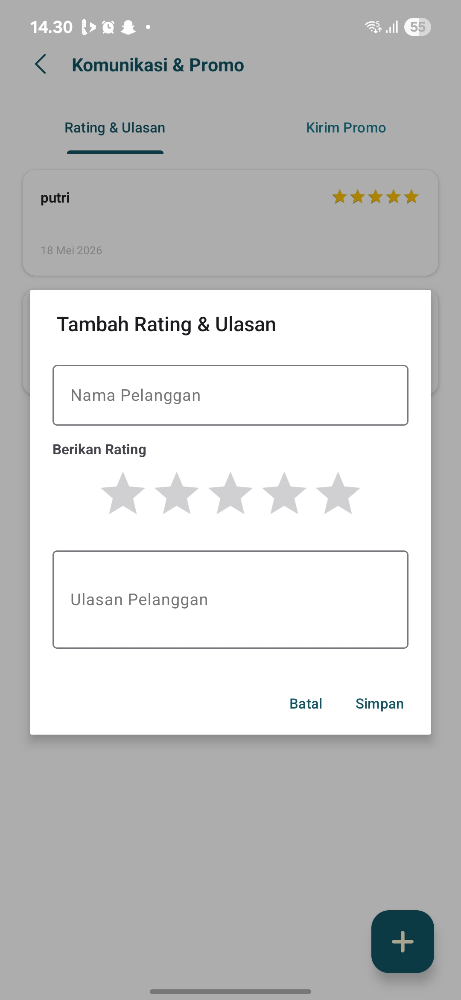
  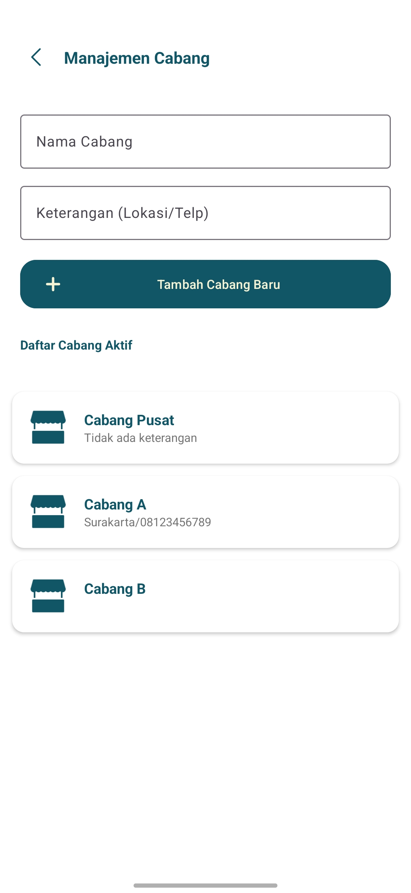
  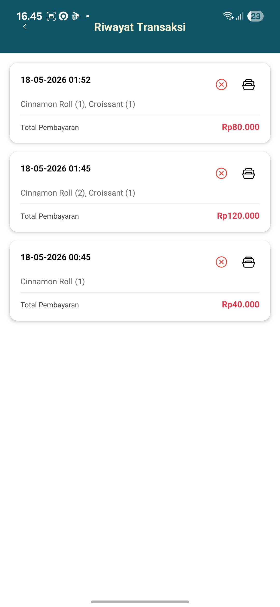

## 🛠️ Teknologi yang Digunakan
- **Bahasa:** Kotlin
- **UI Framework:** Material Components (Material 3)
- **Database:** Firebase Realtime Database
- **Storage:** Firebase Storage
- **Authentication:** Firebase Auth
- **Library Pihak Ketiga:** 
    - [Glide](https://github.com/bumptech/glide) untuk pemuatan gambar.
    - WebView untuk rendering nota HTML.

## 🚀 Cara Instalasi
1. Clone repository ini.
2. Hubungkan project dengan Firebase Console Anda.
3. Unduh file `google-services.json` dan letakkan di folder `app/`.
4. Aktifkan Firebase Auth, Realtime Database, dan Storage.
5. Build dan jalankan aplikasi di Android Studio.